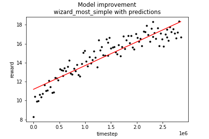

# Wizard - Neural Fictitious Self-Play

For my project in *Applied Deep Learning* @ TU Vienna, I trained a Neural Fictitious Self-Play agent that is able to play the popular card game Wizard. Wizard is a great example to simulate as the complexity rises with the number of players and the number of cards to be played. The game is trick-based: a round is split into several tricks where each player plays one card and the trick can only be won by one player. Next to 4 colors of number cards, there are two types of special cards and a prediction round before the actual game which increases the complexity even more. The complete rule set can be found inside of the [repository](Wizard_Rules.pdf). The environment is built on top of the  [RLCard framework](https://www.rlcard.org).

## Get started

### Installation of the rlcard library
Make sure that you have **Python 3.6+** but currently not Python 3.10+ and **pip** installed. I recommend installing the stable version of `rlcard` with `pip`:

```
pip3 install rlcard[torch]==1.0.5
```

Conda installation is also provided from rlcard. [**conda** installation method](https://anaconda.org/toubun/rlcard):

```
conda install -c toubun rlcard
```

### Download of pretrained models and experiment results

To play against pre-trained models, you need to download a zip from [this link](https://drive.google.com/drive/folders/1SojZP7x6xBqEqGC9WhyDzt5SP818F3fN?usp=sharing) and merge it with the [/experiments](/experiments) folder found in this repository.

### Other dependencies
```
pip install -r requirements.txt
```

## RLCard Framework

The whole wizard environment is built on top of the [RLCard framework](https://www.rlcard.org). The following description is from their website.

> **RLCard: A Toolkit for Reinforcement Learning in Card Games**
>
>RLCard is a toolkit for Reinforcement Learning (RL) in card games. It supports multiple card environments with easy-to-use interfaces for implementing various reinforcement learning and searching algorithms. The goal of RLCard is to bridge reinforcement learning and imperfect information games. RLCard is developed by [DATA Lab](http://faculty.cs.tamu.edu/xiahu/) at Texas A&M University and community contributors.
> 
> *   [GitHub](https://github.com/datamllab/rlcard)
> *   Official Website: [https://www.rlcard.org](https://www.rlcard.org)
> *   Paper: [https://arxiv.org/abs/1910.04376](https://arxiv.org/abs/1910.04376)
> 
> Zha, Daochen, et al. "RLCard: A Platform for Reinforcement Learning in Card Games." IJCAI. 2020.
```
@inproceedings{zha2020rlcard,
  title={RLCard: A Platform for Reinforcement Learning in Card Games},
  author={Zha, Daochen and Lai, Kwei-Herng and Huang, Songyi and Cao, Yuanpu and Reddy, Keerthana and Vargas, Juan and Nguyen, Alex and Wei, Ruzhe and Guo, Junyu and Hu, Xia},
  booktitle={IJCAI},
  year={2020}
}
```

As all scripts/functions are adaptions from other environment implementations of this repository, it should be useful to check out their [GitHub](https://github.com/datamllab/rlcard) to understand how the most basic concepts work. At the bottom of this README, some important extracts from their documentation are provided.

## Learner environment

As datasets, I created three different versions of the game Wizard.

| Attribute | Wizard | Wizard_Simple | Wizard_Most_Simple |
| :------ | :-----: | :-----: | :-----: |
|No. of states | ~255 | ~110 | ~50
|No. of cards & actions | 60| 24 |12
|No. of colors| 4| 4 | 4
|Range of number cards| 1-13| 1-4| 1-3
|No. of Wizard & Fool Cards| 4+4 | 4+4 | 0+0
|Trump Color| red | red | red
|File Prefix | [wizard](rlcard/games/wizard) | [wizard_simple](rlcard/games/wizard_simple) | [wizard_most_simple](rlcard/games/wizard_most_simple)

The `wizard` Environment is the default environment with all rules of the actual game except for two things: Usually, a card is drawn at the start of the game to determine the trump color. As it does not matter which color is drawn, I chose to implement the game with "red" always being the trump color and no option to not have a trump color. Additionally, the game rewards are only decided by the number of tricks made by each player. The trick prediction system is excluded for these first variants but was added later on.

The other two versions were created to reduce the number of possible actions and states so that the Reinforcement Learner can converge faster. Due to the relatively higher ratio of special cards that can be played anytime in `wizard_simple`, the complexity is still quite high. In `wizard_most_simple`, the number of possible actions is reduced even further and complexity is much lower as well due to the removal of Wizard- & Fool-Cards.

### Trick predictions

For *wizard_simple* and *wizard_most_simple* (currently not for default *Wizard*), I created variants that included the trick prediction system of wizard. This means that each player has information about its hand cards and has to decide how many tricks can be made from them. If the player misses the predicted number of tricks, he will get -10P for each wrongly predicted trick. For correct predictions, the players gets 20P + 10P for each trick that was made by him. 

The file prefixes for those variants are called `wizard_trickpreds`, `wizard_s_trickpreds` and `wizard_ms_trickpreds`.

## Library Structure
The purposes of the main modules are listed as below:

*   [**/examples**](examples)**: Main-Folder:** Scripts to run different Wizard environments.
*   [/tests](tests): Unit testing scripts.
* [/experiments](experiments): Experiment results and pre-trained models.
*   [/rlcard/agents](rlcard/agents): Reinforcement learning algorithms and human agents.
*   [/rlcard/envs](rlcard/envs): Environment wrappers (state representation, action encoding etc.)
*   [/rlcard/games](rlcard/games): The six wizard game engines are found in here.

## Neural Fictitious Self-Play (NFSP)

Neural Fictitious Self-Play is a variant of Fictitious Self-Play with Deep Reinforcement Learning to determine action values. The algorithm uses a random mix of predicting the best action from an input state via a classification network and maximizing action values with a Deep Q-Network. The way it works is shown abstractly in the following image.


NFSP also uses some other small tricks like reservoir sampling to improve performance. The full explanation of the algorithm is well explained in the paper by [Heinrich & Silver [2019]](https://arxiv.org/pdf/1603.01121.pdf).

## Run some examples

In this section, I will explain how to run different examples.

### Playing against agents or other humans.
The interesting examples might be playing as a human against a pretrained agent. This is possible with all variants for games with and without trick prediction. To run the scripts, simply execute them with the scripts in `examples/human/` after cloning the repository, installing necessary dependencies and inserting the bot-files into the right folder from [GoogleDrive](https://drive.google.com/drive/folders/1SojZP7x6xBqEqGC9WhyDzt5SP818F3fN?usp=sharing). 

```bash
python examples/human/run_wizard_human_trickpred.py
```
or
```bash
python examples/human/run_wizard_human.py
```
The *trickpred*-variant involves the human player choosing the number of tricks to make, the other variant is only about making as many tricks as possible.

Optional arguments are:
```
--env : Environment to use 
	-> choices for trick predictions: ['wizard_trickpreds','wizard_s_trickpreds',"wizard_ms_trickpreds"]
	-> choices without trick predictions: ['wizard','wizard_simple',"wizard_most_simple"]
--seed : Seed to use -> int
--n_human players : How many human players will play? -> choices=[1,2]
--opponent : Which type of opponent? -> choices=['nfsp','random']
--load_path_agent : Path for the agent model
```

When selecting 2 humans, you can play as both players as well. **Currently, the pre-trained agents are only available for 2 players and 5 cards**, which was a reasonable default setting for all environments.

## Training agents

To train agents on the environment, you can run several files in the `examples`-folder:

### Training without trick predictions

When training **without trick predictions**, the RL algorithm maximizes the number of tricks as positive rewards after a game. 

Run:
```bash
python examples/human/run_wizard.py
```
with options:
```
    --env : Environment to use -> choices = ['wizard',"wizard_simple","wizard_most_simple"]
    --algorithm : RL Algorithm to use -> choices = ['nfsp','dqn']
    --seed : Seed to use -> int
    --load_model : continue the training of an existing model? 
			-> Only possible with a model.pth-file inside of the log_dir -> Bool
    --random_opponent : train against a random opponent?  
			-> Only possible with a opponent_model.pth-file inside of the log_dir -> Bool
    --num_episodes : How many episodes to train for? -> int
    --num_eval_games : How many evaluation games to average on? -> int
    --evaluate_every : How many steps until evaluation? -> int
    --log_dir: Path for the log-file and for the model.pth-file.
```
With the current default values, you do not need additional settings.
Other settings like hyperparameters can be changed inside of the file, but the current values are (more or less) suitable for training. If you load a model, the model is saved as `model_opponent.pth` inside the log directory and can be used to train against.

### Creating a database of played games with agents trying to maximize number of tricks

To find out which hand cards can lead to which trick scores, you can simply let two trained agents play against each other and track the number of tricks that were won by each player. This process is automated with the `create_dataset`-script in the `\examples` folder. Some options are

    --env: choices=['wizard','wizard_simple','wizard_most_simple']
    --save-path: Where to save the dataset.
    --models: model_paths for models to play against each other -> list
    --seed: Random seed
    --num_games: How many games to play? Determines the size of the dataset and should be dependent on the environment you want to create the dataset for.
    

### Processing the dataset and training an XGB Model to predict number of tricks from hand cards

Now that we have a dataset, we can let a simple ML model predict the number of tricks that can be made from our hand cards. The most simple approach would have been to just average and round the number of tricks that were made but a small XGB Model is also quite simple and works well on datasets with many binary variables.

The model training pipeline is inside of this [Jupyter Notebook](XGB_Model_Training_Notebook.ipynb) in the main folder. You need to change the input path to load in the correct dataset.

The XGB model is saved as a .json-file with the format XPYC in the path of your model environment: `/rlcard/games/{MODEL_VARIANT}_trickpreds/xgb_models/{x}P{y}C.json'`.
- {*MODEL_VARIANT*} is the variant of the model you trained it for.
- {*x*} is the number of players.
- {*y*} is the number of maximum cards in that game.

You should change the path to that format before saving the model from the notebook.

### Training with trick predictions

When training **with trick predictions**, the RL algorithm maximizes the game score with a reward calculation based on the wizard rules explained [here](#Trick predictions).  For the algorithm to run without any pre-trained data/model, you need to do the following steps:

1. Run **training without trick predictions** in your environment to train a model that maximizes for number of tricks.
2. **Create a dataset** from this model playing against itself to determine a viable number of tricks to get from hand cards.
3. **Train an XGB Model** from the dataset and insert it in the game engine folder under `rlcard/games/{game_engine}/xgb_models`.
4. Run **training with trick predictions**.

As the previous steps were already explained, the last step can be accomplished with the following script:
```bash
python examples/run_wizard_trickpred.py
```
The options are the same as for the training without trick prediction. The only difference are the choices for the environment: ` ["wizard_trickpreds, wizard_s_trickpreds, wizard_ms_trickpreds"]`

## Results & Tests

To test if the game engine actually works, I implemented human examples where you can play against yourself as previously mentioned. They show that the general game engine works by displaying correct states in correct order. Further tests of the game engine itself were not deemed to be necessary as a lot of time was spent in debugging mode fixing logical errors that led to the game not running correctly until everything worked perfectly.

I still ran some pre-implemented but slightly adapted **unit tests** from the RLCard repository (found in the `\tests`-folder ) for agents, envs and game engines and fixed my code until no errors were raised. Those fixes mostly had to do with unclean code but did not improve training efficacy.

Next to running the game, the engine interface also needs to work so that the agents can train on the transmitted game state, possible legal actions and further information. This can easily be checked by running the RL-Training-Scripts and looking for performance improvement over time. Therefore, I tracked the progress of the learners and visualized it with matplotlib (Same  [notebook](XGB_Model_Training_Notebook.ipynb) as the XGB Learner). The results can be observed in the following graphs.

#### Default Wizard Engine Training with NFSP

#### Wizard_Simple Engine Training with NFSP

#### Wizard_Most_Simple Engine Training with NFSP


The first three graphs show that training without trick predictions led to slow model improvement over time. The **reward metric**  here is the number of tricks to be made. A random agent will make 2.5 tricks on average for 5 cards. Usually, I would have waited until convergence, but as my system (Ryzen 5 3600XT, Geforce RTX 3060 Ti) already took a lot of time for training, I usually stopped when the results were significantly better than random results.

#### Default Wizard Engine Training with NFSP and Trick Prediction

#### Wizard_Simple Engine Training with NFSP and Trick Prediction

#### Wizard_Most_Simple Engine Training with NFSP and Trick Prediction


The next three graphs show performance on the game engine with trick predictions. It can be observed that the rewards slowly improve. When playing average games with 50% winrate and completely random guesses, an **reward metric** of 10 would be a reasonable average. Each correct prediction would result in 45 points on average whereas each wrong prediction would result in -25 points on average. As random agents perform worse in more complex settings, the baseline winrate is therefore lower than 50%. A maximum value of 18.35 for the most simple variant represents a good performance in comparison. It becomes obvious that the more complex environments need much longer training times as the state and legal action space is much larger.

| Environment| Agent Performance | Random Performance |
| :------ | :-----: | :-----: |
|Wizard| 2.59 | 2.41 |
|Wizard Simple| 2.65 | 2.35 |
|Wizard Most Simple| 2.55 | 2.45 |
|Wizard with predictions| 4.60 | 4.13 |
|Wizard S with predictions| 10.31 | 8.86 |
|Wizard MS with predictions| 17.52 | 9.99 |

When looking at evaluation results from 1v1-games against random agents (created with the file `examples/evaluate_wizard.py`, it becomes obvious that some agents did not really learn much and have a lot of room for improvement. Another alternative would be to try out different algorithms. The NFSP algorithm is usually already better in terms of convergence regarding card games with imperfect information, but could be improved even more by [switching out the DQN-Agent against a DMC-Agent](https://deepai.org/publication/monte-carlo-neural-fictitious-self-play-achieve-approximate-nash-equilibrium-of-imperfect-information-games). The hyperparameters for the RL- and SL-Network might need some tuning as well. Increasing the number of layers, layer size and the amount of time until the ε decayed to 0 would lead to more exploration, probably better results but also longer training times. On top of that, the two agents for the less complex prediction environments had training times of about 6h each and the agent for the main Wizard prediction environment was trained for 16h. [Other](https://arxiv.org/abs/1603.01121) [researchers](https://towardsdatascience.com/douzero-mastering-doudizhu-with-reinforcement-learning-864363549c6a) were training for several days with Multi-GPUs on similarly complex environments with other neural RL algorithms until convergence was achieved. Therefore, one can expect further improvement when training for longer on this environment as well.

### Time estimation for the project

The project took more time than expected. The implementation of the basegame and making sure that all interfaces with the rlcard repository were working was a huge part. Then, debugging and optimization of hyperparameters until performance improvement could be observed was another time-intensive step. At last, I needed to check again that everything was running and write this README. To break it down into smaller steps, here is a table with the estimated time needs for this milestone of the *Applied Deep Learning* project.

| Work step | Approximate time needed|
| :------ | :-----: |
|Reading & Understanding the papers | 3h |
|Understanding the rlcard repository and its elements | 3h |
|Building a functioning game of wizard | 10h |
| Implementing a human agent for wizard | 3h |
| Building the interface to automatic environment | 5h |
| Creating simpler variants of the game | 5h |
| 1st Debugging | 5h |
| Active time spent for optimizing hyperparameters & training | 5h |
| Build the dataset pipeline | 4h |
| Creating variants of all three games with trick predictions | 5h |
| 2nd Debugging | 3h |
| Build the dataset pipeline | 4h |
| Active time spent for optimizing hyperparameters & training | 3h |
| Adapting unit tests | 2h |
| Building evaluation pipeline & Writing this README | 6h |

This would make a **time total of 66h** which is quite realistic. Maybe some steps took less time but iterative debugging and small fixes probably took more time than depicted here. On top of that, the* total training time *on my computer was probably 40h, which included several over-night runs but is not counted towards the time spent on this milestone, as it can be done passively.


------------


------------


------------


## Further potentially relevant RLCard documentation (from RLCard)
### API Cheat Sheet
#### How to create an environment
You can use the the following interface to make an environment. You may optionally specify some configurations with a dictionary.
*   **env = rlcard.make(env_id, config={})**: Make an environment. `env_id` is a string of a environment; `config` is a dictionary that specifies some environment configurations, which are as follows.

*   `seed`: Default `None`. Set a environment local random seed for reproducing the results.
*   `allow_step_back`: Default `False`. `True` if allowing `step_back` function to traverse backward in the tree.
*   Game specific configurations: These fields start with `game_`. Currently, we only support `game_num_players` in Blackjack.

Once the environemnt is made, we can access some information of the game.
*   **env.num_actions**: The number of actions.
*   **env.num_players**: The number of players.
*   **env.state_shape**: The shape of the state space of the observations.
*   **env.action_shape**: The shape of the action features (Dou Dizhu's action can encoded as features)

#### What is state in RLCard
State is a Python dictionary. It consists of observation `state['obs']`, legal actions `state['legal_actions']`, raw observation `state['raw_obs']` and raw legal actions `state['raw_legal_actions']`.

#### Basic interfaces
The following interfaces provide a basic usage. It is easy to use but it has assumtions on the agent. The agent must follow [agent template](docs/developping-algorithms.md). 
*   **env.set_agents(agents)**: `agents` is a list of `Agent` object. The length of the list should be equal to the number of the players in the game.
*   **env.run(is_training=False)**: Run a complete game and return trajectories and payoffs. The function can be used after the `set_agents` is called. If `is_training` is `True`, it will use `step` function in the agent to play the game. If `is_training` is `False`, `eval_step` will be called instead.